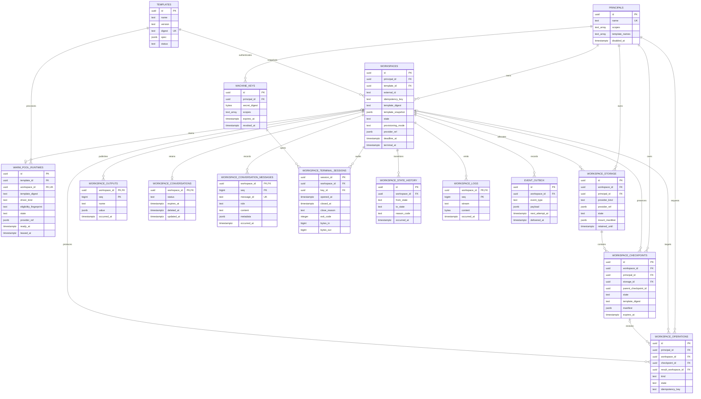

# Architecture

```text
caller (machine key)
  → pocketcoder-server (Hono REST/WSS on Bun)
  → durable workspace queue (PostgreSQL)
  → workspace driver (Docker container or Kubernetes Job)
  → one isolated runtime per workspace
  → storage driver (host data roots or a Kubernetes PVC)
  → pocketcoder-agent (PID 1 supervisor)
  → PocketCoder-owned AgentAPI → template-declared coding agent
```

There is exactly one execution path. Capacity pressure queues workspaces; it
never routes work to a shared process. Drivers are deployment configuration —
neither callers nor templates can select them.

## Components

| Component | Package | Responsibility |
|-----------|---------|----------------|
| pocketcoder-server | `apps/pocketcoder-server` | One Hono app: REST + OpenAPI, machine auth, agent WSS, relay; scheduler, outbox, reconciliation loops |
| pocketcoder-agent | `apps/pocketcoder-agent` | PID 1 in every workspace: registration, setup, AgentAPI launch, stable transcript capture, health, relay, checkpoint quiescing, TERM/KILL |
| pcd | `packages/cli` | Public bundled operator CLI: migrations, principals/keys, template validation, workspace inspection, doctor |
| contracts | `packages/contracts` | zod schemas: template v1alpha1, workspace states, WSS protocol frames, events, error codes |
| runtime-core | `packages/runtime-core` | Store contract, scheduler (admission/fairness/sweeps), template registry, outbox dispatcher, restart reconciliation |
| db | `packages/db` | PostgreSQL store, Drizzle schema and generated migrations under an advisory lock |
| drivers | `packages/drivers` | Docker/Kubernetes runtime drivers, filesystem/PVC checkpoint storage, file/Kubernetes secret resolvers |
| testkit | `packages/testkit` | In-memory store, fake driver, fake AgentAPI, template fixtures |

## Durable database schema

The diagram shows the PostgreSQL tables and their enforced foreign-key
relationships. Template identity and provider metadata are also denormalized
onto runtime records so reconciliation can validate immutable digests without
depending on mutable operator configuration.



The Drizzle definition in `packages/db/src/schema.ts` is the source of truth;
the diagram intentionally omits non-relational detail fields and indexes.

## Workspace state machine

```text
queued → provisioning → connected → ready ─┬→ terminating → succeeded|failed|canceled|expired
                                            └→ preserving → preserved
                                                                  │
                                                  restore checkpoint
                                                                  ↓
                                                     new queued workspace
```

- `queued → provisioning` happens under admission: fair round-robin across
  principals, FIFO within one, bounded by global/per-principal/per-template
  limits. Up to three infrastructure launch attempts may requeue — but only
  before a provider object exists; once a container ran, it is never
  relaunched automatically (the agent may have had external effects).
- `connected` requires redeeming the single-use registration secret and a
  matching template digest.
- `ready` requires every required template service healthy; the caller's
  launch input is erased at this point.
- Terminal states never reopen. Every transition commits atomically with its
  state-history row and a signed outbox event.
- Preservation stops the writer, snapshots only template-declared mounts,
  verifies an immutable manifest, and ends the source execution as
  `preserved`. Restore always allocates an independent writable copy and a
  fresh workspace/provider/credential lineage.

## Agent protocol

The supervisor opens one outbound WSS connection to `/v1/agent/connect` —
there is no inbound route into a workspace. First connection: one-time
registration secret; the ack delivers a reconnect credential (memory-only)
plus the normalized exec spec (setup, derived AgentAPI harness/service, native
ownership flag, timeouts). Frames are JSON with
per-connection monotonic sequence numbers; the newest accepted connection
(epoch) exclusively speaks for the workspace.

Agent → server: `registered`, `heartbeat`, `process_state`, `service_health`,
`log_chunk`, `proxy_response`, `proxy_stream_start`, `proxy_stream_chunk`,
`proxy_stream_end`, `termination_ack`, `source_resolved`,
`checkpoint_status`, `restore_status`, `output_published`,
`conversation_message`, `attachment_ack`, `attachment_result`,
`attachment_resolved`, `terminal_opened`, `terminal_output`, `terminal_closed`.
Server → agent: `registered_ack`, `proxy_request`, `proxy_stream_ack`,
`proxy_stream_cancel`, `signal`, `health_probe`,
`shutdown`, `prepare_checkpoint`, `attachment_start`, `attachment_chunk`,
`attachment_finish`, `attachment_abort`, `attachment_resolve`, `terminal_open`,
`terminal_input`, `terminal_resize`, `terminal_close`.

Workspace protocol v3 adds the attachment frames: caller files stream to the
supervisor one acknowledged, bounded chunk at a time and land under
`$HOME/.pcd/attachments` via same-directory temporary files and atomic
renames; ID resolution feeds the generated message manifest.

Workspace protocol v4 adds interactive PTY frames. A terminal exists only
when the immutable template declares its command and a caller with
`terminal:attach` opens the separate client WebSocket. PTY processes and a
64-KiB replay ring live in the supervisor, so client and supervisor-socket
disconnects do not stop them. Input refreshes workspace activity; output does
not. Session metadata is audited, but input and output content are not.

Workspace protocol v5 adds template-declared streamed HTTP responses. The
supervisor forwards one response chunk, waits for the matching server
acknowledgement, and cancels its upstream fetch when the HTTP reader closes, a
limit or deadline fires, or the workspace connection ends. AgentAPI-native
snapshots created under v5 declare `GET /events`; older snapshots remain
buffered.

Servers accept v1–v5 supervisors, so rollout is server-first — connected v1/v2 supervisors
keep text-only relay and attachment requests fail with
`attachment.unsupported` until the workspace image updates. Terminal requests
on v1–v3 supervisors return `terminal.protocol_unsupported`. Stream routes on
v1–v4 supervisors return `relay.streaming_unsupported`, allowing clients to
fall back to stable history polling.

A separate, narrowly scoped pool-enrollment socket (its own version axis)
serves optional task-agnostic warm runtimes. Its only server message is a
one-shot workspace assignment after an atomic durable claim; the runtime then
uses the existing workspace registration protocol. There is no reusable
worker lease, caller-supplied command execution, or tunnel. Interactive PTYs
run only the immutable template-declared command over typed v4 frames. File
transfer exists only as the bounded attachment upload into supervisor-owned
storage — there is no general file API. The relay forwards only
template-declared loopback routes with exact method/path/query/size/deadline
checks.

Disconnects keep the workspace alive for the template's `disconnectGrace`;
after a server restart, nonterminal workspaces are reconciled against
labeled provider objects and supervisors simply reconnect.

## Security model

- Machine keys: named, scoped, digest-stored, instantly revocable, redacted
  from logs. No human accounts, sessions, or browser login.
- Templates are the only execution surface, and they are operator-deployed
  files — the API cannot introduce new images or commands.
- Interactive terminals require separate attach/read scopes, run only the
  template command, and retain metadata rather than session content.
- Workspaces: digest-pinned image, non-root uid, read-only root, tmpfs
  writes, dropped capabilities, no privilege escalation, no inbound network.
- Persistent paths are reviewed logical template declarations. Physical host
  paths, PVC subpaths, checkpoint locations, and mount flags never enter the
  public API. Checkpoints reject traversal, unsafe links, devices, sockets,
  FIFOs, setuid/setgid modes, integrity mismatch, and quota expansion.
- Git/model credentials are deployment-resolved read-only files under
  `/run/pocketcoder/secrets`; provider input and secrets are outside
  checkpointed paths.
- Launch input reaches the coding agent in memory; registration secrets are
  single-use; reconnect credentials never touch the workspace filesystem.
- Workspace-readable credentials are workspace-scoped and expire with the
  workspace; model policy is enforced at the deployment's gateway, not by
  hiding tokens inside the sandbox ([security model](security.md)).
- Lifecycle events are HMAC-signed; consumers verify, deduplicate, and poll.
- Conversation events are contract-bounded and principal-scoped, expire by
  template policy, and support explicit content deletion. Native workspaces
  project only stable AgentAPI history; legacy adapters retain responsibility
  for semantic redaction.
